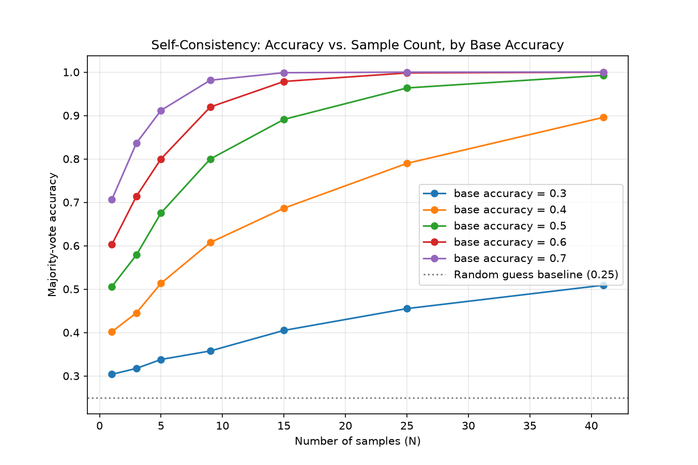

# Result: Self-Consistency — Does Voting Across More Samples Actually Help?

## The claim being tested

Self-consistency (sampling a model N times and taking the majority answer)
is one of the simplest forms of test-time compute — spend more inference
compute instead of retraining, and get better accuracy. This experiment
checks whether that scaling actually holds, whether it has diminishing
returns, and — the more interesting question — whether it depends on how
good the model already is at the task in a single shot.

## Method

A simulated multiple-choice task with 4 options. A single sample is correct
with some fixed `base_accuracy`, and wrong otherwise (picking uniformly
among the remaining wrong options when it misses). For each combination of
base accuracy (0.3 to 0.7) and number of samples N (1 to 41), 5,000
independent trials measured how often the MAJORITY vote across N samples
landed on the correct answer.

## Result

| Base accuracy | N=1 | N=3 | N=5 | N=9 | N=15 | N=25 | N=41 |
|---|---|---|---|---|---|---|---|
| 0.3 | 0.304 | 0.317 | 0.338 | 0.357 | 0.405 | 0.455 | 0.509 |
| 0.4 | 0.402 | 0.445 | 0.513 | 0.607 | 0.686 | 0.790 | 0.896 |
| 0.5 | 0.506 | 0.579 | 0.675 | 0.800 | 0.891 | 0.963 | 0.993 |
| 0.6 | 0.603 | 0.714 | 0.800 | 0.919 | 0.978 | 0.998 | 1.000 |
| 0.7 | 0.706 | 0.836 | 0.912 | 0.981 | 0.999 | 1.000 | 1.000 |

At base accuracy 0.5 and above, voting drives accuracy toward ~100% within
a modest number of samples. At base accuracy 0.4, it climbs more slowly
but still reaches 0.896 by N=41. At base accuracy 0.3, though, voting
barely moves the needle — 0.304 at N=1 crawls to only 0.509 at N=41, far
short of the near-perfect scaling the higher-accuracy rows show with the
same sample budget.

## Why this happens

Majority voting works by letting independent correct answers "outvote"
independent wrong ones — but that only works reliably once a single
sample is more likely to be right than any specific way of being wrong.
With 4 options, random guessing scores 0.25, so a base accuracy of 0.3 is
only barely better than chance: the correct answer isn't wrong often
enough to reliably form a majority, and errors are still common enough to
occasionally cluster on the same wrong option by chance. At 0.5 and above,
each additional sample is disproportionately more likely to reinforce the
correct answer than any single wrong one, so the majority converges fast.
Below that threshold, more samples mostly buys a slower, weaker climb
rather than the dramatic gains seen higher up.

## Limitations

- This assumes each sample is truly independent and errors are spread
  uniformly across wrong options. Real model sampling isn't perfectly
  independent (the same underlying weights/reasoning failure can produce
  the same wrong answer repeatedly), and errors are often systematically
  biased toward one specific wrong answer rather than spread evenly —
  either effect could make real-world self-consistency perform worse than
  this simulation suggests.
- Base accuracy was treated as fixed and known here. In practice a model's
  single-sample accuracy varies by question difficulty within the same
  task, which this simulation doesn't capture.
- Only 4-option multiple choice was tested; open-ended generation tasks
  (where "majority vote" requires matching semantically similar but
  non-identical answers) behave differently and weren't modeled here.

## Takeaway

Self-consistency isn't a technique that reliably converts compute into
accuracy regardless of the starting point — it has a real dependency on
how good the model already is at the task. For a model that's already
better than chance by a meaningful margin, voting is a strong, fast way to
approach near-perfect accuracy. For a model that's only marginally better
than random guessing, throwing more samples at it produces slow,
incomplete gains rather than rescuing it — the compute is being spent, but
the return on it is far weaker than the headline framing of "just sample
more" suggests.